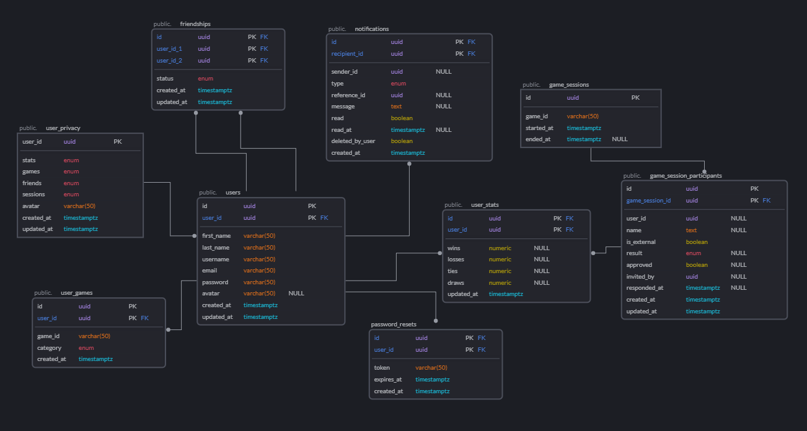

# 🚧 Under Construction 🚧

# Checkmate

A board game stats app with a social component, mobile and web friendly. A great place to research board games, track your stats, and compete with your friends. You can also make wishlists and keep track of your collection.

## Tech & Frameworks:

- Monorepo structure using Turbo build system and Yarn as a package manager

#### Web && Mobile

- React for Web
- React Native for Mobile 🚧 Coming soon
- Vite
- Tamagui UI Library
- `zxcvbn` for password strength checking 🚧 Coming soon
- Zustand for state management
- Storybook for UI testing 🚧 Coming Soon

#### Backend

- Node/Typescript Backend that utilizes Axios to make requests to [Board Game Geek API](https://boardgamegeek.com/wiki/page/BGG_XML_API2).
- Database is Postgres with Knex, hosted through AWS RDS 🚧 Coming Soon
- Backend utilizes `Jest` and `Supertest` for acceptance tests along with a Test Database 🚧 Coming soon
- Swagger API Docs 🚧 Coming soon
- Python/ AWS S3 for Stats & Graphs 🚧 Coming Soon

## Database Design

